# Introduction-to-RDBMS

## MySQL Intro

### What is MySQL?

---

## MySQL RDBMS

### What is RDBMS?

### What is a Database Table?

### What is a Relational Database?

---

## MySQL SQL

### What is SQL?

### How to Use SQL

---

## MySQL Comments

### MySQL Single-line Comments

```mySQL
    -- This is a Single line Comment
```

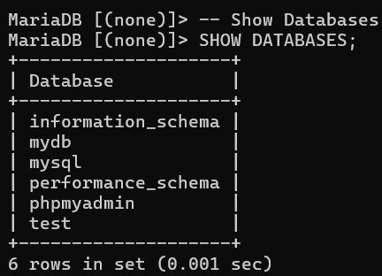

### MySQL Multi-line Comments

```mySQL
    /* This
    is
    a
    multi-line
    Comment */
```

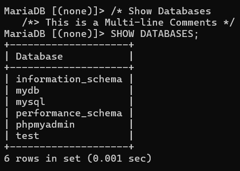

---

## MySQL Operators

### Arithmetic operators

1. Addition(+)

```mySQL
    SELECT 30 + 20;
```

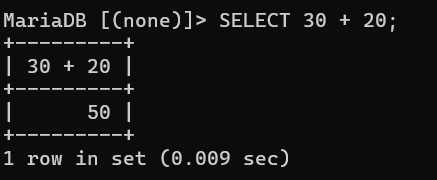

2. Subtraction(-)

```mySQL
    SELECT 100 - 35;
```

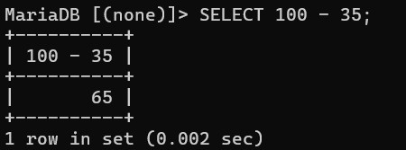

3. Multiplication(\*)

```mySQL
    SELECT 25 * 5;
```

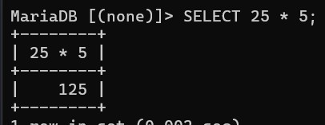

4. Division(/)

```mySQL
    SELECT 200 / 50;
```

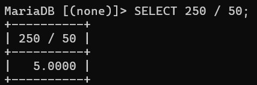

5. Modulus(%)

```mySQL
    SELECT 40 % 4;
```

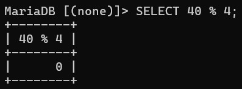

### Comparison operators

1. Equal to (=)

```mySQL
    SELECT * FROM products
    WHERE price = 25;
```

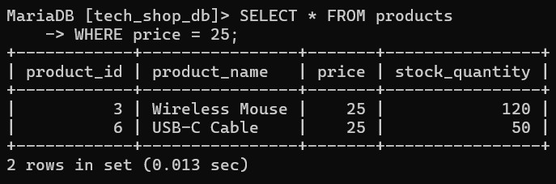

2. Greater than (>)

```mySQL
    SELECT * FROM products
    WHERE price > 300;
```

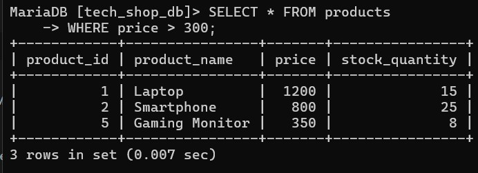

3. Less than (<)

```mySQL
    SELECT * FROM products
    WHERE price < 100;
```

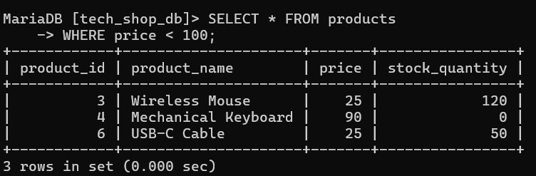

4. Greater than or equal to (>=)

```mySQL
    SELECT * FROM products
    WHERE stock_quantity >= 25;
```

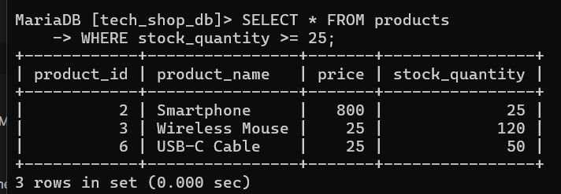

5. Less than or equal to (<=)

```mySQL
    SELECT * FROM products
    WHERE stock_quantity <= 15;
```

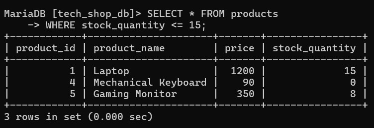

6. Not equal to (<>)

```mySQL
    SELECT * FROM products
    WHERE stock_quantity <> 0;
```

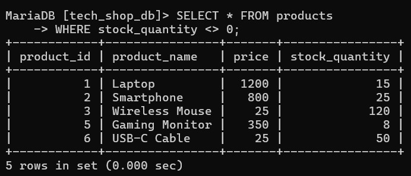

### Compound operators

1. Add equals (+=)

```mySQL
UPDATE products
SET price = price + 10;
```

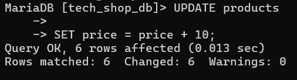

2. Subtract equals (-=)

```mySQL
UPDATE products
SET stock_quantity = stock_quantity - 5
WHERE product_name = 'Laptop';
```

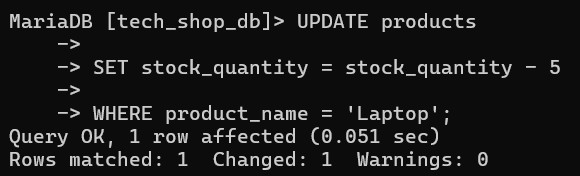

3. Multiply equals (\*=)

```mySQL
UPDATE products
SET price = price * 2;
```

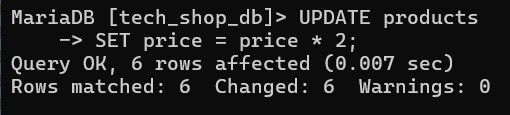

4. Divide equals (/=)

```mySQL
UPDATE products
SET price = price / 2;
```

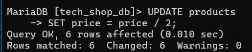

5. Modulo equals (%=)

```mySQL
UPDATE products
SET stock_quantity = stock_quantity % 10;
```

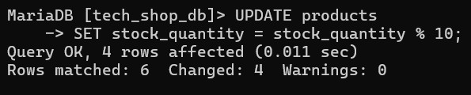

6. Bitwise AND equals (&=)
7. Bitwise exclusive equals (^-=)
8. Bitwise OR equals (|\*=)

> ⚠️ **Important Note on Compound Operators:**
> Unlike programming languages like C++ or JavaScript, Standard MySQL does NOT support compound operators like `+=`, `-=`, `*=`, or `/=`. Instead, explicit assignment expressions like `SET price = price + 10` must be used during `UPDATE` operations.

### Bitwise operators

1. Bitwise AND (&)
2. Bitwise OR (|)
3. Bitwise exclusive 0R (^)

### Logical operators

1. AND

```SQL
    SELECT * FROM products
    WHERE price > 100 AND stock_quantity > 10;
```

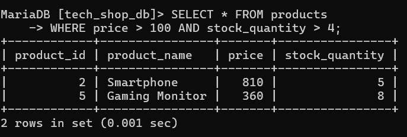

2. OR

```SQL
    SELECT * FROM products
    WHERE price > 1000 OR stock_quantity = 0;
```

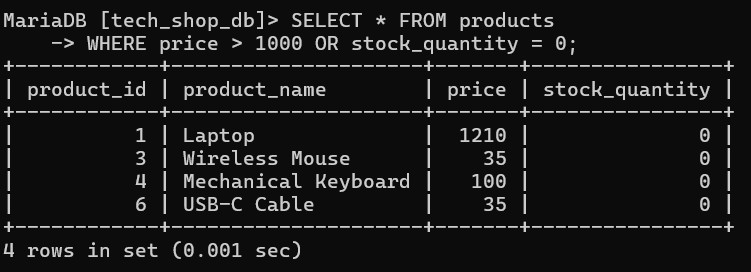

3. NOT

```SQL
    SELECT * FROM products
    WHERE NOT price = 25;
```

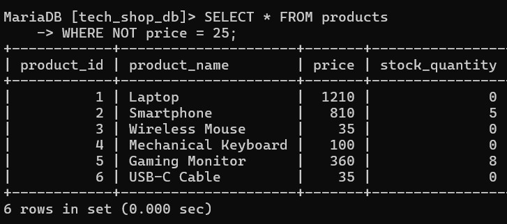

4. BETWEEN

```SQL
    SELECT * FROM products
    WHERE price BETWEEN 50 AND 500;
```

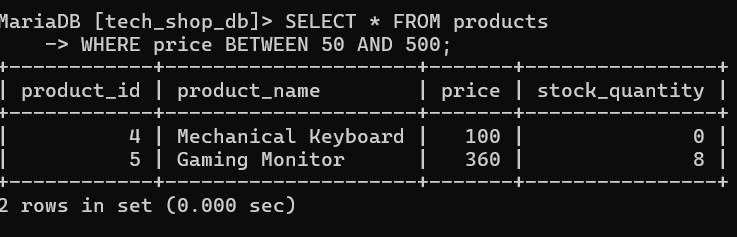

5. IN

```SQL
    SELECT * FROM products
    WHERE product_name IN ('Laptop', 'Smartphone', 'Wireless Mouse');
```

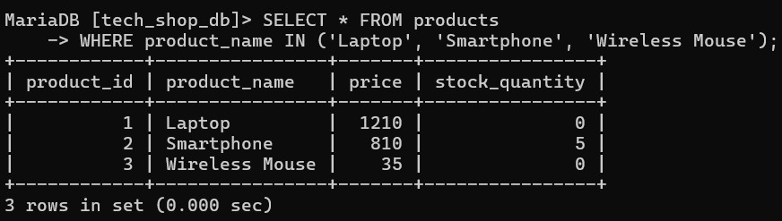

6. LIKE

```SQL
    SELECT * FROM products
    WHERE product_name LIKE 'Gaming%';
```

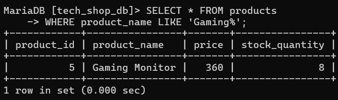

7. EXISTS

```SQL
    SELECT * FROM products
    WHERE EXISTS (SELECT product_id FROM products WHERE price > 1000);
```

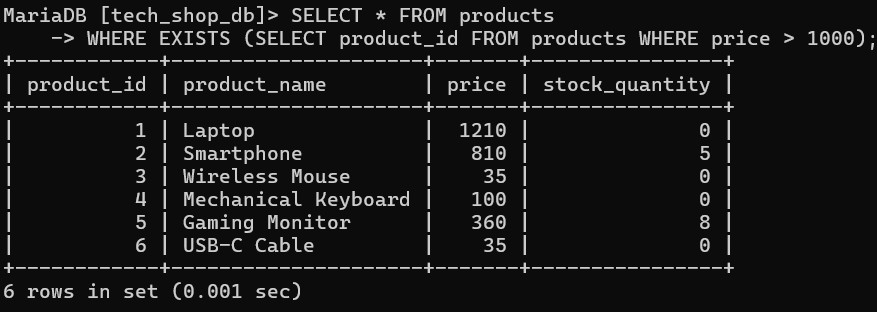

8. ANY / SOME

```SQL
    SELECT * FROM products
    WHERE price > ANY (SELECT price FROM products WHERE price IN (25, 90));
```

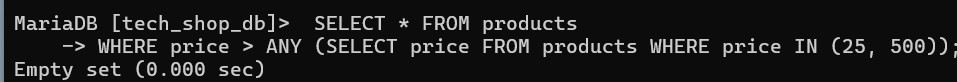

9. ALL

```SQL
    SELECT * FROM products
    WHERE price > ALL (SELECT price FROM products WHERE price IN (25, 90));
```

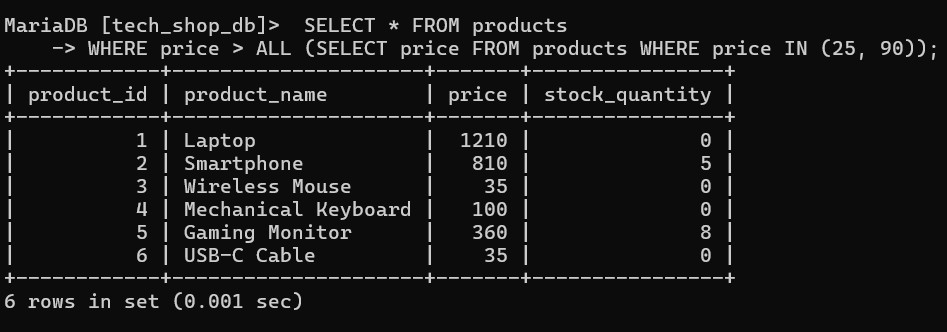

---

## ⚖️ Copyright & Licensing

**Copyright © 2026 T.M.S.U. Thennakoon (Sahan Udara). All rights reserved.**

This documentation and its associated SQL code snippets are part of the **MySQL Zero to Hero** learning roadmap, independently curated and maintained by **Sahan Udara**.

- **Author Profiles:** [LinkedIn](https://www.linkedin.com/in/mrnexora/) | [GitHub](https://github.com/mr-nexora)
- **Permitted Use:** This material is strictly intended for personal education, reference, and open-source project showcasing. You are welcome to study, reference, and fork this repository for non-commercial educational purposes.
- **Restrictions:** Unauthorized duplication, plagiarism, re-hosting, or redistribution of these compiled notes and structured explanations on other websites, courses, or commercial media without explicit prior written consent from the author is strictly prohibited.

_All structural updates and verified execution screenshots belong to the author's personal portfolio assets._
